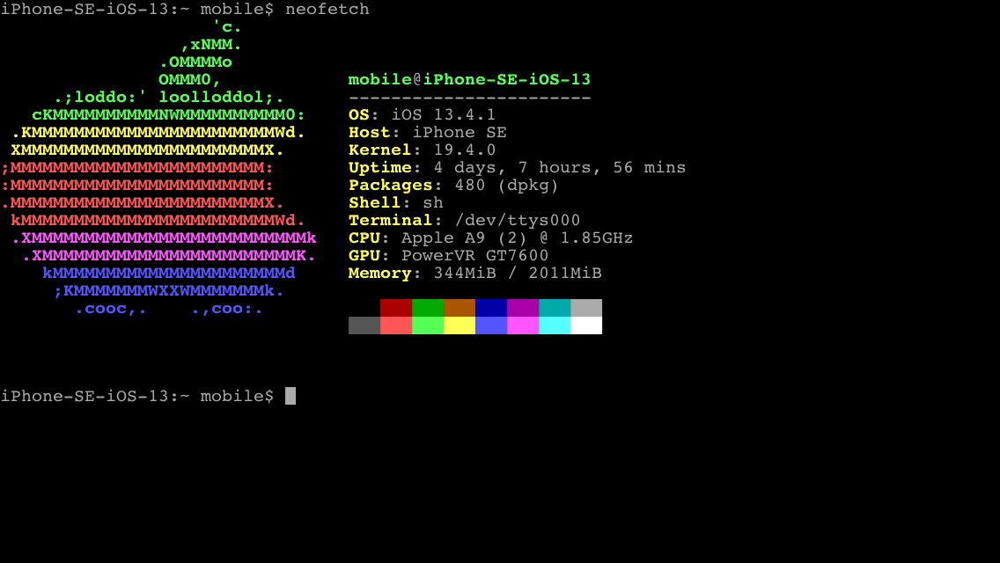

Hello! I'm Vincent Loh, a high school sophomore.

I do a lot of programming, these days mostly contest programming.
A few years ago I spent most of my time making (pretty bad) web games
with p5js, and still occasionally make little animation projects, like
[this one](https://github.com/vmhl87/simple-animation-framework).

[usaco](https://github.com/vmhl87/usaco) is probably my most active repo,
which I update every few days. I mantain a github repo with most of the work
I do in my [algorithm design](https://github.com/vmhl87/alg_design) class
at school. It has a bunch of random projects and notes.

C and C++ are the languages I primarily use, especially for contest programming.
Occasionally I use Python or JS, and rarely Processing. I messed around with
Haskell a bit, but I still prefer C.

Hardware:

PC

My desktop is an AMD machine - Ryzen 5 2600 running Debian 12.
I used to use Ubuntu, but recently switched to this current setup - Gnome
and snap were getting on my nerves.

I have a similar setup to my laptop: i3 as a window manager, with a tmux-based
terminal setup. Unlike that laptop, though, I use a graphical terminal (st)
rather than the framebuffer one, which has issues with scaling on my monitor.

My i3 bindings are a bit strange - find them [here](pc).

Laptop

My choice of laptop is rather odd - it's a Lenovo ideapad 3 chromebook.

With an Intel Celeron N4020 underclocked to 800mhz and barely functional
Intel integrated graphics, its performance is far from good. However,
combined with a pretty substantial battery, it gets a very high SOT.
I end up having to charge once every week or so, despite using it as my
daily driver.

I used to run this laptop in "standard" chromeOS, doing most
of my work in the VT2 virtual terminal emulator (essentially a worse framebuffer
console) but I flashed a UEFI bootloader and installed Debian 12.

Though I have i3 configured, I do the majority of my work
in the TTY, with a combination of nvim, tmux, and w3m.

My [framebuffer graphics library](https://github.com/vmhl87/fbgui) was originally
built for use on this laptop.

Phone

I use a jailbroken iphone SE (first generation, from 2016) on iOS 13.4.1.
It has the clang toolchain and SDK installed, so I can (and sometimes do)
code on this device.

It is jailbroken with Odysseyra1n, running the Procursus bootstrap.

I am not very good at Objective-C, but I have written a few tweaks -
for example [radianator](https://github.com/vmhl87/radianator).

Not a lot of my older projects are on my github. I have various web games
on [OpenProcessing](https://openprocessing.org/user/250345), most in various
stages of completeness.

I'm `i.frame` on Discord, feel free to contact me!
