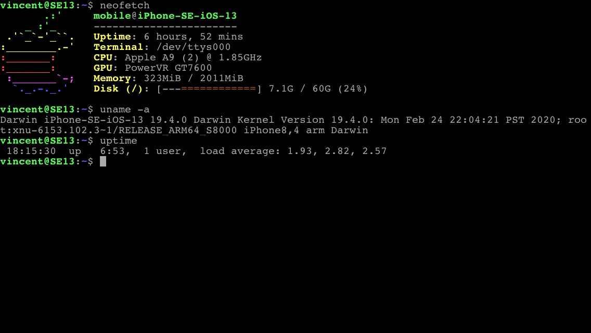

Hello! I'm Vincent Loh, a high school sophomore.

I do a lot of programming, these days mostly usaco-style contest programming.
A few years ago I used to spend a lot of time making (pretty bad) web games
with p5js, and I still occasionally make little animation projects.

C and C++ are the languages I primarily use, especially for contest programming.
I occasionally use Python or JS, and rarely Processing. Recently I've been
messing around with functional programming, and learning a bit of Haskell.

Hardware:

Ubuntu 22.04 LTS (PC)

	My primary computer is an AMD machine - Ryzen 5 2600 running Ubuntu.
	It has a pretty standard setup running Gnome.

	I dislike IDEs and primarily use a combination of nvim and tmux.
	I may in the future switch to an i3 on Debian setup similar to the
	one on my laptop.

	

Debian 12 (Laptop)

	My choice of laptop is rather odd - it's a Lenovo ideapad 3 chromebook.
	
	With an Intel Celeron N4020 underclocked to 1.1GHz and Intel integrated
	graphics, its performance is far from good. However, combined with a
	pretty big battery, its battery life is very very good. I end up having
	to charge once every week or so, despite using it for school.

	A few months ago, I ran this laptop in "standard" chromeOS, doing most
	of my work in the VT2 virtual terminal emulator. (essentially a TTY)
	Recently I flashed a UEFI bootloader and installed Debian 12.

	Though I have i3 configured, I end up doing the majority of my work
	in the TTY, with a combination of nvim, tmux, and w3m.

	
	
	

Phone

	I use a jailbroken iphone SE (first generation, from 2016) on iOS 13.4.1.
	It has the clang toolchain and SDK installed, so I can (and sometimes do)
	code on this device.

	I am jailbroken with a combination of checkra1n and unc0ver, running the
	Elucubratus bootstrap. Though I have Zebra installed, I am weird and
	prefer Cydia.

	

	I am not yet fluent in Objective-C, but I have written a few tweaks -
	particularly [radianator](https://github.com/vmhl87/kelvin).

Not a lot of my older projects are on my github. I have various web games
on [OpenProcessing](https://openprocessing.org/user/250345), most in various
stages of completeness.

I'm `i.frame` on Discord, feel free to find me!
