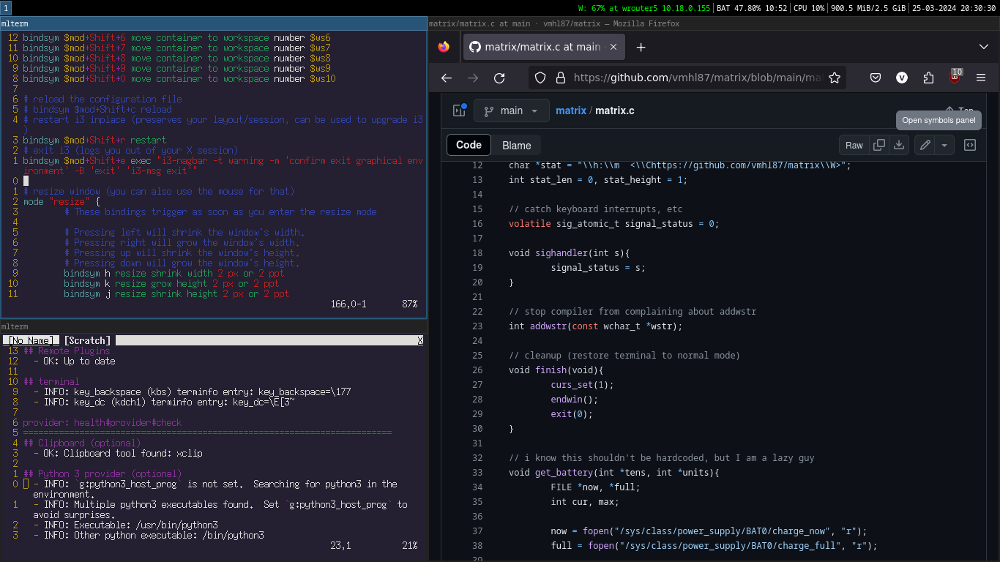

Hello! I'm Vincent Loh, a high school senior.

I make various little projects here and there, and also enjoy competitive programming
(USACO, Codeforces, AtCoder). I also mantain [a little blog](https://vmhl87.github.io/starship)
that post to every so often (though not enough).

Hardware:

Desktop

AMD machine (Ryzen 5 2600) running Debian 12. Minimalistic i3 setup.

Laptop

Lenovo Chromebook (N4020, underclocked to 800mhz) also running i3 / Debian 12.

As expected, its performance is very lacking. Its battery life makes up for it,
managing almost 24 hours of screen-on time (for a standard usage profile) or
12 hours (at continous maximum processor usage) with a single charge.

Especially under i3, light web browsing and terminal work runs acceptably well.
For more intensive tasks, I open an SSH or TightVNC tunnel back to my desktop.

I have some old web games on [OpenProcessing](https://openprocessing.org/user/250345),
mostly uncompleted.
